# BookApi
- Projects link [BookApi](https://mete-bookapi.surge.sh)

# Pupose of the project 
My website is light clone of GoodReads app.   
I want to make my own library and act like GoodReads.   

# Features of the project.
    1. Register,
    2. Login,
    3. Search Books Feature,
    4. Add Books to user own library,
    5. Create 3 shelves for own library named Reading, Finished, Want to Read.
    6. Update the books in users own library,
    7. Delete the books from users library,
    Update the users profile,
    8. Update the status of the books like progress
    9. Get Detailed information for books.

# Tests
    All tests for backend is in the same directory where the testing file is.

    For frontend test is in the __Test__ directory.  

    to start the tests just use Test commend for each directory.

# Standard user flow  

When you open my site the first page is;
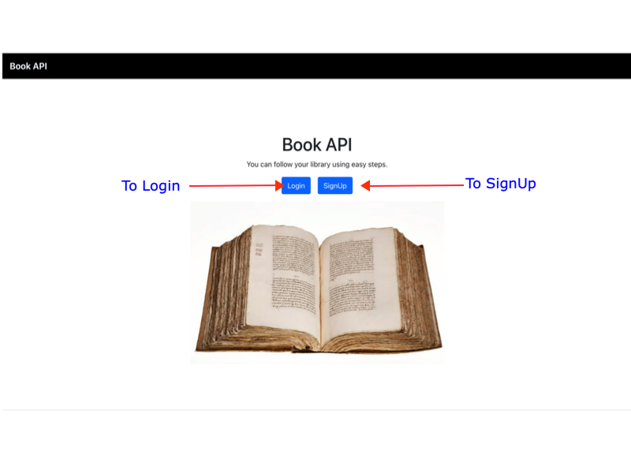 

To start the process first you should SignUp.
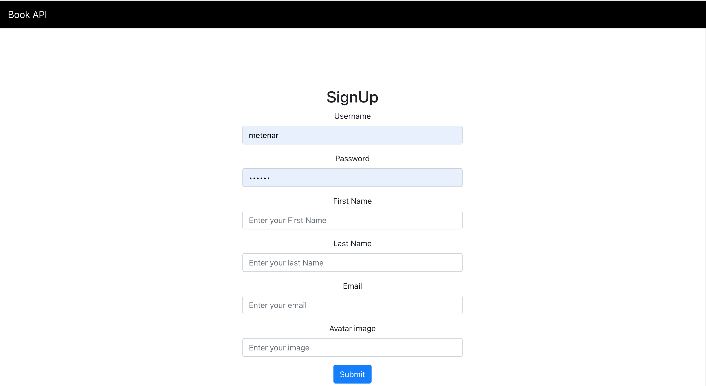

If you are already signedUp then you can click login
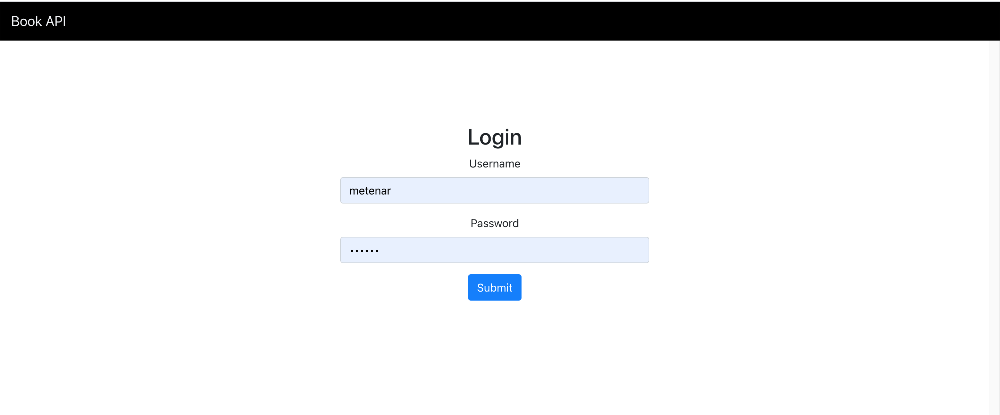

When you logged in the first books list showed which is related about war.
But you can search any book title 
Site showed newest books first ordered. and first 20 books only.
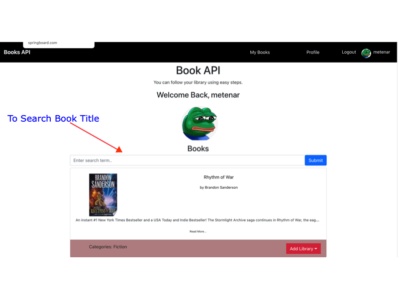

If you want to see next 20 books you can click the page number at the bottom.
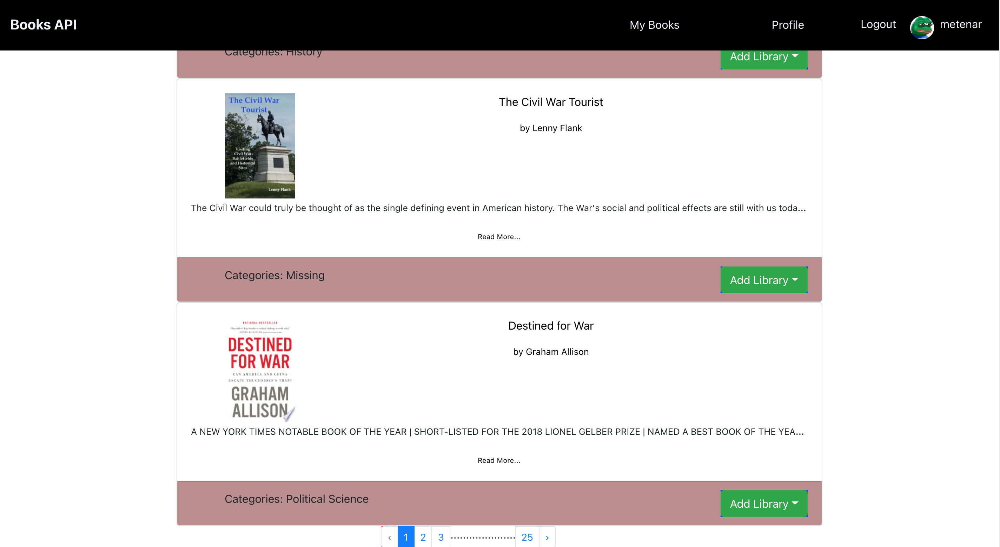

If you want to add any book to your library you can just click Add Library
button and choose which shelves you want.(Reading, Finished, Want to Read)

When you add a book to your library site redirect you to your books page  
and shows recently added book.
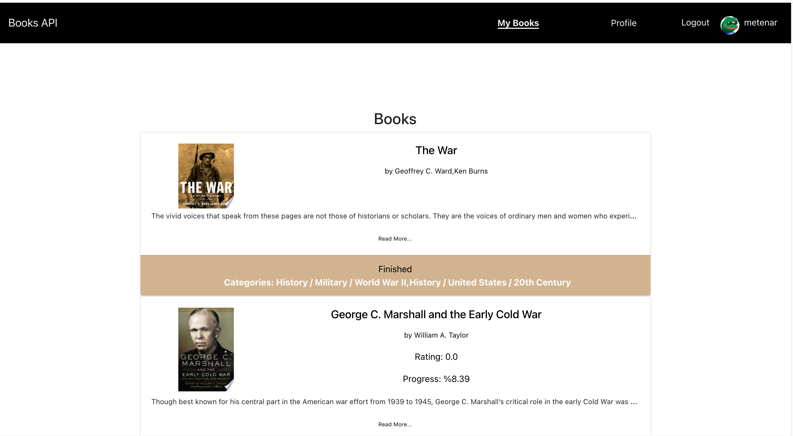

If you have more then one book and if they are different shelves then you can clicked the link (Reading, Finished, Want to Read) and this link directed you related shelves and showes only these books.

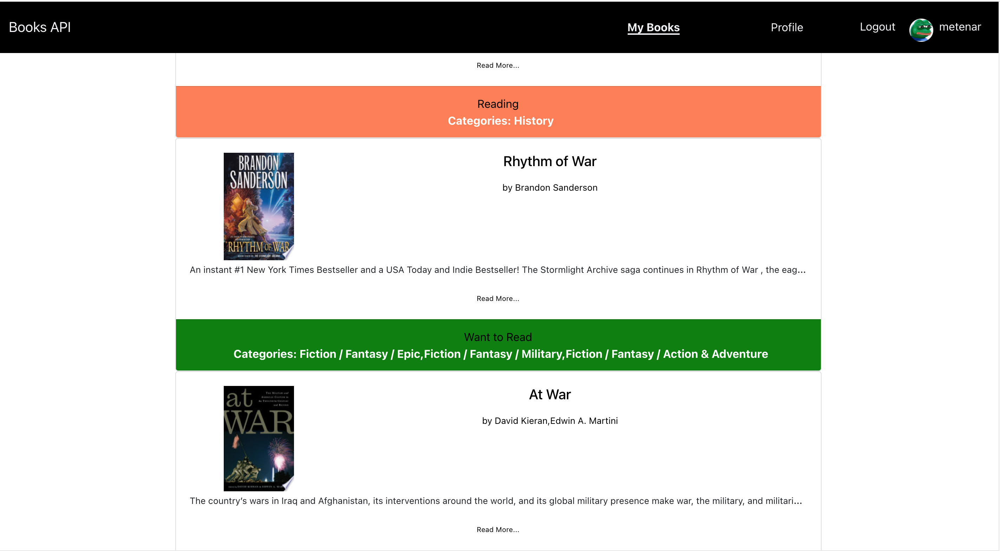
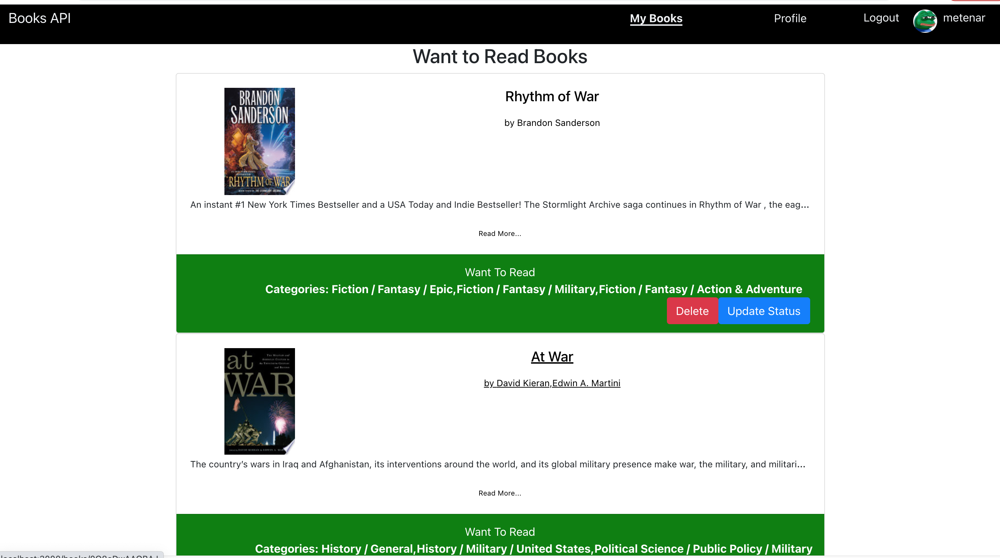

If you want to delete or update the books you can click update or delete buttons.

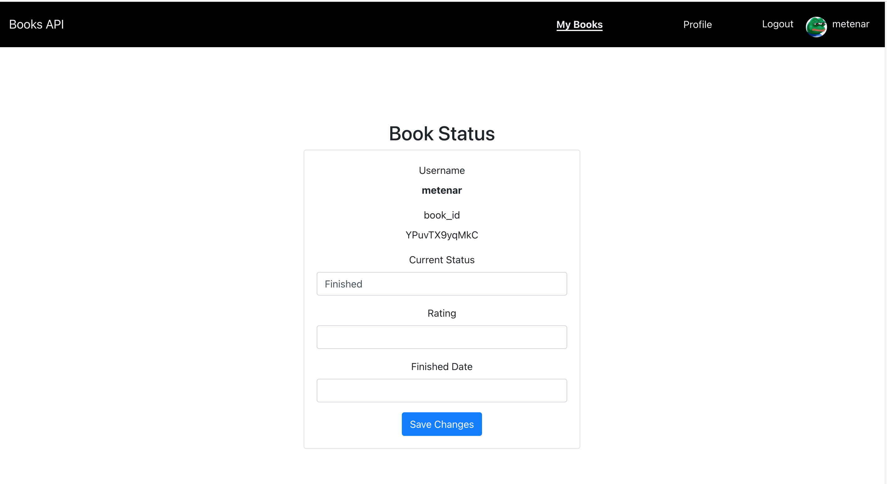

You can update your progress or you can change the status of the book like finished.

You can get more details about the book if you click on the book title 
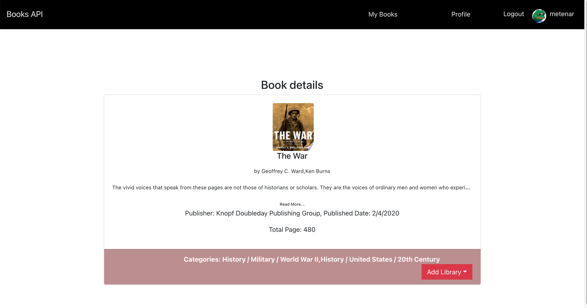

And lastly you can update your profile using profile button on navbar.
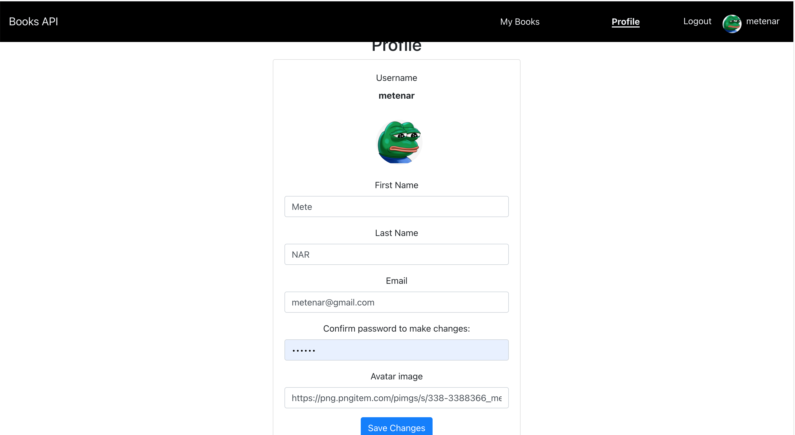

# Technology Used

    1. Node Js,
    2. React,
    3. Reactstrap

 

