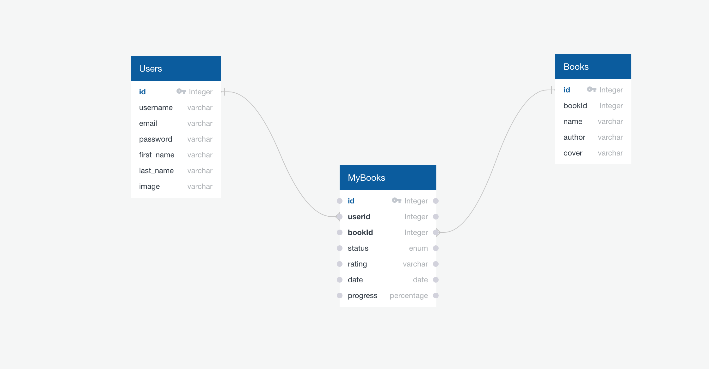

# Capstone-2 Proposal

## Website Goal
The aim of this website is creating own library and making goodreeds clone. User can follow his readings, rate the books.

## User Demographics 
The target demographic is the one who wants to read and follow his books.

## API Data
Data will be sourced from the Open Library API.

## Project Outline

### Database Schema

### Potential Issues with APIs
Creating User interface and communicate the API will be challenging. 

### Sensitive Information
Users will be able to create an account and log in, so passwords will need to be secured, as well as API keys.

### App Functionality
* users can register, login, and logout
* all users can:
	* search for specific book 
	* view additional details about related search.
    * also search Genre of the books
* registered users can:
	*  add own library so they can store the books with 3 different shelves
        - Want to read,
        - Still reading,
        - Already finished. 
	*  get information acording to their book, add rating also add finished date. 

### User Flows
#### All Users
* user types in the search bar or genre options and returns list of related search.
* if clicked on list detailed information related this search is returned

#### Registered Users
* log in to their account
* nav bar includes links to view their pages and thier book library
* can add books to thier library they can add this book to 3 different shelves.
    - Want to read,
    - Still reading,
    - Already finished. 
* can click the each book to get detailed information about this book.
* they can rate the book and also they can add date when they finnished reading the book. 

### Features beyond simple CRUD
visualization with cover of book 

#### What tech stack will use
* for frontend React will use,
* for backend Express will be used.
* I plan to make this app evenly used full stack app.
* It will be website. 

